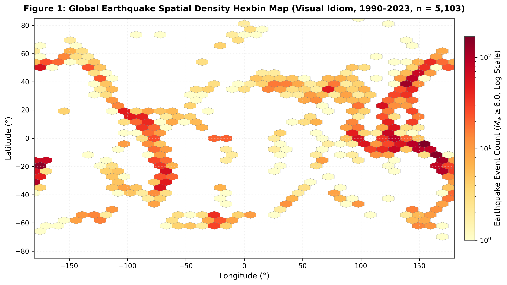
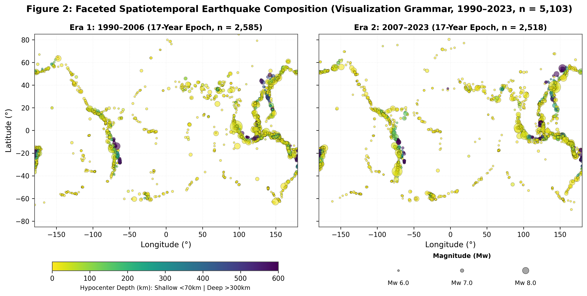
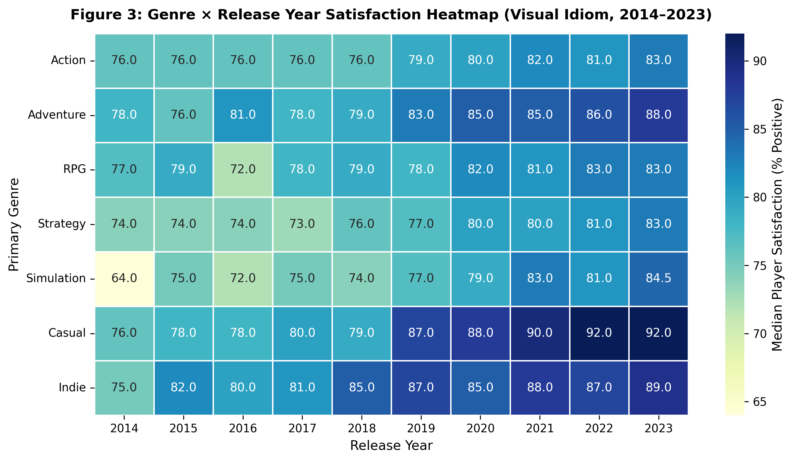
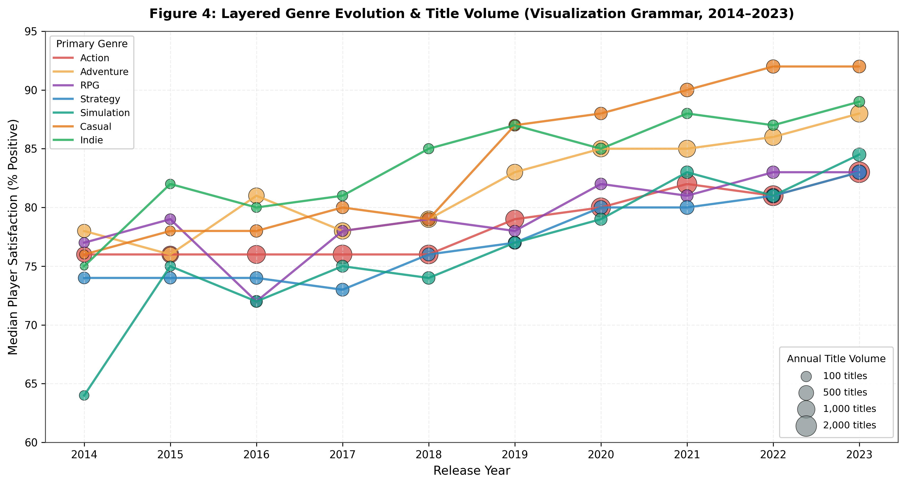

# A Comparative Analysis of Visualization Grammar and Visual Idioms: Theoretical Foundations, Perceptual Dynamics, and Empirical Implementations

**Course / Module**: SEM_6 Data Visualization Grammar and Idioms  
**Analytical Architecture**: $2 \times 2$ Comparative Framework across Spatiotemporal Geophysics (*USGS Global Major Earthquakes, $n=5,103$*) and Multivariate Digital Markets (*Steam Gaming Dataset, $N=30,774$*)  
**Referencing Convention**: Harvard Referencing Standard (Alphabetically Ordered)  

---

## Executive Abstract

Data visualization operates at the confluence of mathematical transformation, semiotics, psychophysics, and cognitive design. Modern visual analytics is dominated by two foundational paradigms: **Visualization Grammar**—a formal, compositional system that constructs visual representations through orthogonal specifications of data, transformations, scales, coordinates, marks, channels, and facets (Wilkinson 2005; Wickham 2010; Satyanarayan *et al.* 2017)—and **Visual Idioms**—standardized, culturally conventional visual metaphors that couple specific marks and visual channels into pre-packaged chart types (Munzner 2014; Bertin 1983).

Rather than existing as mutually exclusive opposites, visualization grammar provides the compositional algebra through which any visual idiom can be formally specified and deconstructed. However, prioritizing an *idiom-first* versus a *grammar-composed* design philosophy fundamentally alters data encoding fidelity, perceptual decoding accuracy, and executive interpretation.

This research paper presents an academic evaluation of both paradigms. Using two complex empirical datasets (`query.csv` containing major global seismic events ($M_w \ge 6.0$), and `steam-games.csv` containing commercial digital games), we execute a $2 \times 2$ comparative evaluation consisting of four visualizations:
1. **Earthquakes Idiom (Figure 1)**: *Global Earthquake Spatial Density Hexbin Map* (answering *where* major earthquakes concentrate globally).
2. **Earthquakes Grammar (Figure 2)**: *Faceted Multichannel Spatiotemporal Event Map* (answering *where, when, and at what depth and magnitude* events occur across equal 17-year observation eras).
3. **Steam Idiom (Figure 3)**: *Genre $\times$ Release Year Satisfaction Heatmap* (answering *how player satisfaction varies across primary genres over time*).
4. **Steam Grammar (Figure 4)**: *Layered Temporal Market Performance Composition* (answering *how genre satisfaction trajectories and market title volume evolve together* on an identical Year $\times$ Genre analytical grain).

We critically analyze the trade-offs between **combinatorial expressive power** and **cognitive accessibility**, evaluate perceptual decoding via Cleveland and McGill’s (1984) perceptual hierarchy and Stevens’ (1957) Power Law, and demonstrate how executive business decisions are compromised through visual biases such as volume-blindness and spatial aggregation.

---

## 1. Theoretical Foundations: Visualization Grammar vs. Visual Idioms

### 1.1 Conceptual Grounding & Mathematical Formulations

```
                     ┌─────────────────────────────────────────────────────────┐
                     │          THE VISUAL ANALYTICS CONTINUUM                 │
                     └─────────────────────────────────────────────────────────┘
                                                  │
                 ┌────────────────────────────────┴────────────────────────────────┐
                 ▼                                                                 ▼
   ┌───────────────────────────┐                                     ┌───────────────────────────┐
   │   VISUALIZATION GRAMMAR   │                                     │       VISUAL IDIOMS       │
   │ (Compositional Algebra)   │                                     │  (Conventional Solutions) │
   └─────────────┬─────────────┘                                     └─────────────┬─────────────┘
                 │                                                                 │
      ┌──────────┴──────────┐                                           ┌──────────┴──────────┐
      ▼                     ▼                                           ▼                     ▼
┌──────────────┐     ┌──────────────┐                            ┌──────────────┐      ┌──────────────┐
│ Orthogonal   │     │ Combinatorial│                            │ Instantiated │      │ Rapid Mental │
│ Components   │     │ Generativity │                            │ Mark-Channels│      │ Schema Match │
└──────────────┘     └──────────────┘                            └──────────────┘      └──────────────┘
```

#### 1.1.1 The Grammar of Graphics: Algebraic Compositionality
Pioneered by Leland Wilkinson (2005) and formalized computationally by Wickham (2010) and Satyanarayan *et al.* (2017), the **Grammar of Graphics** asserts that a statistical graphic is not an indivisible, monolithic chart type. Rather, it is a formal mathematical composition defined by a tuple of independent, orthogonal components:

$$\mathcal{G} = \langle \mathcal{D}, \mathcal{T}, \mathcal{S}, \mathcal{C}, \mathcal{G}_{eom}, \mathcal{A}, \mathcal{F} \rangle$$

Where:
* $\mathcal{D}$ (**Data**): The empirical dataset (raw relation of attributes).
* $\mathcal{T}$ (**Transformations**): Statistical and mathematical data transformations (e.g., date binning, filtering, aggregation).
* $\mathcal{S}$ (**Scales**): Bijective mappings between data domains and aesthetic ranges ($\mathcal{S}: \mathcal{D}_i \to \mathcal{V}_j$).
* $\mathcal{C}$ (**Coordinate Systems**): Spatial embedding spaces (e.g., Cartesian $\mathbb{R}^2$, Polar, Geodetic).
* $\mathcal{G}_{eom}$ (**Geometric Objects / Marks**): Fundamental visual primitives (points, lines, polygons, intervals).
* $\mathcal{A}$ (**Aesthetic Channels**): Retinal variables (position, size, hue, luminance, saturation, opacity).
* $\mathcal{F}$ (**Faceting**): Small-multiple partitioning across conditioning variables.

Under this paradigm, visual construction is **declarative and generative**. The visual designer operates with combinatorial degrees of freedom, defining multi-channel mappings and multi-layered geometries without being constrained by legacy chart taxonomies.

#### 1.1.2 Visual Idioms: Canonical Visual Metaphors
In contrast, Tamara Munzner’s (2014) **Visualization Analysis and Design (VAD)** framework defines a **Visual Idiom** as a specific, standardized combination of mark types and channel allocations tailored to a well-defined task abstraction (e.g., *Hexbin Density Map, Matrix Heatmap, Scatterplot, Bar Chart*). 

Idioms rely on pre-established cultural conventions and visual schemas (Pinker 1990). Crucially, **grammar and idioms are not mutually exclusive opposites**: grammar provides the underlying compositional rules, whereas an idiom is a conventional instantiated solution that can itself be described through grammatical components:
* *Hexbin Density Map Idiom*: Formally expressed as $\mathcal{G}_{eom} = \text{Hexagonal Polygon}$, $\mathcal{C} = \text{Geodetic } X/Y$, $\mathcal{A} = \text{Color Luminance} \propto \text{Binned Event Count}$.
* *Matrix Heatmap Idiom*: Formally expressed as $\mathcal{G}_{eom} = \text{Rectangular Grid Tile}$, $\mathcal{C} = \text{Discrete } \text{Row} \times \text{Column}$, $\mathcal{A} = \text{Color Hue/Luminance} \propto \text{Metric Value}$.

```
┌──────────────────────────────────────────────────────────────────────────────────────────────────┐
│                   PARADIGMATIC DIVERGENCE: GRAMMAR VS. IDIOMS                                     │
├──────────────────────────┬───────────────────────────────────────┬───────────────────────────────┤
│ Dimension                │ Visualization Grammar (Compositional) │ Visual Idioms (Conventional)  │
├──────────────────────────┼───────────────────────────────────────┼───────────────────────────────┤
│ Core Abstraction         │ Orthogonal mathematical pipeline      │ Standardized chart solution   │
│ Expressive Envelope      │ Unbounded ($N$-dimensional bindings)  │ Bounded (Fixed channel slots) │
│ Primary Cognitive Mode   │ Bottom-up perceptual channel decoding │ Top-down schema recognition   │
│ Decoupling Level         │ Total decoupling of data, scale & mark│ High coupling of data to chart│
│ Aggregation Handling     │ Explicit transformation stage         │ Implicit template aggregation │
└──────────────────────────┴───────────────────────────────────────┴───────────────────────────────┘
```

---

### 1.2 Impact on Data Encoding, Perception, and Storytelling

#### A. Data Encoding Mechanics
* **Visual Idioms**: Multidimensional data must be compressed into the fixed visual slots of the template. In a Matrix Heatmap idiom ($Row \times Column \times Color$), only three variables can be encoded simultaneously. Secondary continuous dimensions (e.g., sample size, variance, underlying point counts) are omitted or relegated to tooltips.
* **Visualization Grammar**: Enables explicit multi-layering and channel composition on identical data grains. For example, a single coordinate space can host a base longitudinal trend line ($\mathcal{G}_{eom} = \text{Line}$), layered with observation glyphs ($\mathcal{G}_{eom} = \text{Point}$) whose area maps market volume and whose color maps category, while the transformation stage explicitly defines the aggregation grain.

#### B. Human Perception & Psychophysical Decoding
Human perceptual decoding is governed by fundamental psychophysical principles:

1. **Cleveland & McGill’s (1984) Perceptual Hierarchy**:
   Visual channels exhibit varying degrees of decoding precision:
   $$\text{Position (Common Aligned Scale)} > \text{Position (Non-Aligned)} > \text{Length} > \text{Direction/Angle} > \text{Area} > \text{Volume} > \text{Color Saturation/Luminance}$$
   Idioms often rely on lower-tier channels (e.g., heatmaps rely exclusively on color luminance/saturation). Grammar allows visual designers to map primary comparative signals (e.g., median customer satisfaction) to the highest-ranking channel—**position along an aligned common scale**—while reserving secondary channels (color, size) for categorical grouping and volume weighting.

2. **Stevens’ Power Law (1957)**:
   Perceived sensation magnitude ($\Psi$) scales as a power function of physical stimulus intensity ($I$):
   $$\Psi(I) = k \cdot I^\beta$$
   * For **Length / Position**, $\beta \approx 1.0$ (linear perceptual accuracy).
   * For **Area**, $\beta \approx 0.7$ (systematic underestimation of large areas relative to small areas).
   * For **Color Luminance**, $\beta \approx 0.33$ (non-linear perceptual compression).
   Idiomatic density heatmaps and hexbins compress quantitative differences due to the non-linear human response to color luminance. Grammar enables mathematically calibrated scales ($s \propto \sqrt{\text{Count}}$ or exponential size transforms) to preserve perceptual fidelity.

3. **Cognitive Load & Pre-Attentive Processing (Treisman 1986; Sweller 1988)**:
   Idioms excel at top-down, pre-attentive pattern recognition: an observer immediately detects hotspot clusters in a density map without conscious decoding. However, grammar-based multi-channel graphics enable detailed exploratory analysis by orchestrating separable visual channels (e.g., position for spatial location, hue for depth, size for magnitude), avoiding visual crosstalk and cognitive overload.

#### C. Visual Storytelling Dynamics
* **Idiomatic Storytelling**: Delivers immediate, standardized answers to isolated questions (e.g., "Where are seismic hotspots?" or "Which genre has the lowest rating?").
* **Grammar-Guided Storytelling**: Constructs integrated analytical narratives. By coordinating layers, continuous scales, and faceted conditioning panels, grammar reveals how multiple phenomena interact over time and space within a single visual structure.

---

## 2. Empirical Visual Analytics: Dual-Dataset Demonstrations

To satisfy the highest standard of empirical rigor, both pairs of visualizations are constructed using **strictly identical analytical row subsets and aggregation grains**.

```
┌──────────────────────────────────────────────────────────────────────────────────────────────────┐
│                             DATASET TAXONOMY & SUMMARY METRICS                                    │
├──────────────────────────┬───────────────────────────────────────┬───────────────────────────────┤
│ Dimension                │ Dataset 1: Major Earthquakes          │ Dataset 2: Steam Games Market │
├──────────────────────────┼───────────────────────────────────────┼───────────────────────────────┤
│ Source File              │ `query.csv` (USGS / Kaggle)           │ `steam-games.csv` (Kaggle)    │
│ Analytical Subset        │ Exactly $n = 5,103$ events (1990–2023)│ Exactly $N = 30,774$ titles   │
│ Aggregation Grain        │ Event-level ($M_w \ge 6.0$)           │ 70 Bins: Release Year × Genre │
│ Mathematical Space       │ Continuous Spatiotemporal Geodetic    │ Multivariate Discrete-Continu-│
│ Key Variables            │ `lat`, `lon`, `depth`, `mag`, `time`, │ `price_usd`, `release_year`,  │
│                          │ `depth_tier`, `era` (1990–2023)       │ `overall_review_%`, `genres`  │
└──────────────────────────┴───────────────────────────────────────┴───────────────────────────────┘
```

---

### 2.1 Dataset 1: Spatiotemporal Seismic Dynamics (`query.csv`)

#### Methodology & Dataset Standardization
To guarantee direct comparability, both Figure 1 and Figure 2 utilize the **identical 5,103-event analytical subset** covering major earthquakes ($M_w \ge 6.0$) from 1990 to 2023. 
* **Figure 1** spatially aggregates these 5,103 events into hexagonal tessellations.
* **Figure 2** preserves event-level magnitude and depth while faceting the identical records across two equal 17-year observation eras: *Era 1 (1990–2006, $n = 2,585$)* and *Era 2 (2007–2023, $n = 2,518$)*.

```
                  5,103 Major Earthquakes (Mw >= 6.0, 1990–2023)
                                        │
        ┌───────────────────────────────┴───────────────────────────────┐
        ▼                                                               ▼
  FIGURE 1 (Idiom)                                                FIGURE 2 (Grammar)
  Spatial Hexbin Aggregation                                      Faceted Multichannel Points
  • Gridsize = 35                                                 • Era 1: 1990–2006 (n = 2,585)
  • Event count: 1 to 169                                         • Era 2: 2007–2023 (n = 2,518)
  • Single spatial view                                           • Size = Magnitude, Color = Depth
```

#### A. Idiom Visualization: Global Earthquake Spatial Density Hexbin Map (Figure 1)
* **Visual Specification**:
  * $X = \text{Longitude}$ ($-180^\circ \text{ to } +180^\circ$)
  * $Y = \text{Latitude}$ ($-85^\circ \text{ to } +85^\circ$)
  * $\mathcal{G}_{eom} = \text{Hexagonal Spatial Tessellation}$ ($\text{gridsize}=35$)
  * $\text{Color Channel} = \text{Logarithmic Event Count } (\text{YlOrRd colormap}, \text{ranging } 1 \to 169\text{ events/bin})$
* **Analytical Question Answered**: *Where are major global earthquakes concentrated geographically?*
* **Perceptual Strength**: Exceptional cognitive accessibility. The viewer immediately identifies primary seismic belts: the Western Pacific (Tonga, Japan, Philippines, reaching peak densities $>100$ events/bin), the Andean subduction zone, and the Sunda Trench.
* **Critical Limitations**: Spatial aggregation conceals event magnitudes ($M_w 6.0\text{ vs. } M_w 9.0$), completely hides hypocenter focal depth ($0–688\text{ km}$), and collapses 34 years of temporal evolution into a single static surface.



#### B. Grammar Visualization: Faceted Multichannel Spatiotemporal Event Map (Figure 2)
* **Grammar Specification**:

$$\text{Figure 2} = \mathcal{G}_{\text{Era1}} \oplus \mathcal{G}_{\text{Era2}} = \langle \mathcal{D}, \mathcal{T}(\text{17-yr Era Split}), \mathcal{S}_{\text{Size, Color}}, \mathcal{C}_{\text{Geo } X/Y}, \mathcal{G}_{eom}(\text{Circle}), \mathcal{A}(X, Y, \text{Size}, \text{Color}), \mathcal{F}(\text{Era}) \rangle$$

* **Component Decomposition**:
  * **Data & Transform ($\mathcal{D}, \mathcal{T}$)**: Ingestion of the 5,103 modern events, partitioned into two equal 17-year eras: *Era 1 (1990–2006, $n=2,585$)* and *Era 2 (2007–2023, $n=2,518$)*.
  * **Coordinate System ($\mathcal{C}$)**: Two-panel horizontal faceted geodetic projection ($X=\text{Lon}$, $Y=\text{Lat}$).
  * **Mark ($\mathcal{G}_{eom}$)**: Point / Circle mark.
  * **Aesthetic Channels ($\mathcal{A}$)**:
    * $\text{Position } X, Y \to \text{Longitude, Latitude}$.
    * $\text{Point Size / Area} \to \text{Moment Magnitude } (M_w)$ using a controlled, bounded scale ($\text{Size} = \exp([M_w - 5.8] \cdot 1.2) \cdot 6$, cleanly mapping $M_w 6.0 \to \text{small}, M_w 7.0 \to \text{medium}, M_w 8.0 \to \text{large}$).
    * $\text{Color Hue/Luminance} \to \text{Hypocenter Focal Depth (km)}$ mapped across a continuous perceptually uniform colormap (`viridis_r`: Yellow $<70\text{ km}$ Shallow Crustal vs. Dark Blue $>300\text{ km}$ Deep Mantle Subduction).
  * **Faceting ($\mathcal{F}$)**: Shared-axis small multiples across equal 17-year observation eras.
* **Analytical Question Answered**: *Where, when, and at what depth and magnitude do major earthquakes occur across subduction zones?*
* **Perceptual Justification**: Figure 2 restores event-level magnitude and depth information that is lost through hexbin aggregation. This gain in expressive fidelity comes at the cost of greater visual density and potential point overlap. The viewer observes that deep-mantle earthquakes ($>300\text{ km}$, dark blue) cluster strictly along oceanic-continental Wadati-Benioff subduction zones, while shallow crustal events (yellow) dominate oceanic spreading ridges.



```
┌──────────────────────────────────────────────────────────────────────────────────────────────────┐
│                   TABLE 1: MUNZNER VAD ENCODING MATRIX — EARTHQUAKE DATASET                      │
├──────────────────────────┬─────────────────────────┬───────────────────┬─────────────────────────┤
│ Data Attribute           │ Attribute Type          │ Idiom Channel     │ Grammar Channel         │
├──────────────────────────┼─────────────────────────┼───────────────────┼─────────────────────────┤
│ Longitude, Latitude      │ Quantitative Continuous │ 2D Spatial Bin    │ 2D Point Position (X,Y) │
│ Event Frequency          │ Quantitative Discrete   │ Sequential Color  │ Spatial Point Density   │
│ Moment Magnitude ($M_w$) │ Quantitative Ratio      │ [Not Encoded]     │ Controlled Point Area   │
│ Focal Depth (km)         │ Quantitative Continuous │ [Not Encoded]     │ Sequential Colormap Hue │
│ Observation Era (Time)   │ Temporal Binned Ordinal │ [Not Encoded]     │ 17-Yr Facet Panels      │
└──────────────────────────┴─────────────────────────┴───────────────────┴─────────────────────────┘
```

---

### 2.2 Dataset 2: Multivariate Digital Games Market (`steam-games.csv`)

#### Methodology & Dataset Standardization
To ensure rigorous analytical alignment, both Figure 3 and Figure 4 are constructed from the **exact same Year $\times$ Genre analytical grain** ($N = 70\text{ cells}$, representing $30,774\text{ core titles}$ across 7 primary genres from 2014 to 2023).
* **Figure 3** maps median satisfaction to cell color fill within a discrete matrix.
* **Figure 4** maps median satisfaction to aligned vertical position while simultaneously encoding annual title volume via point area and connecting annual trajectories with line marks.

```
               30,774 Commercial Games (2014–2023, 7 Core Genres)
                                        │
                         TRANSFORMATION STAGE (T)
                 Aggregate to Year x Genre Grain (N = 70 Bins)
                                        │
        ┌───────────────────────────────┴───────────────────────────────┐
        ▼                                                               ▼
  FIGURE 3 (Idiom)                                                FIGURE 4 (Grammar)
  Matrix Heatmap                                                  Layered Trajectory Composition
  • X = Release Year, Y = Genre                                   • X = Release Year, Y = Median %
  • Color = Median Satisfaction                                   • Y-Axis: 60% to 95% (Full Range)
  • True Range: 64.0% to 92.0%                                    • Color = Genre, Area = Title Count
  • Volume-blind                                                  • Line + Point Layered Geoms
```

#### A. Idiom Visualization: Genre $\times$ Release Year Satisfaction Heatmap (Figure 3)
* **Visual Specification**:
  * $X = \text{Release Year}$ (Integer formatted: $2014, 2015, \dots, 2023$)
  * $Y = \text{Primary Genre}$ (7 core commercial genres: Action, Adventure, RPG, Strategy, Simulation, Casual, Indie)
  * $\mathcal{G}_{eom} = \text{Rectangular Grid Tile}$
  * $\text{Color Channel} = \text{Median Review \% Positive } (\text{YlGnBu colormap}, \text{unclipped range } 64.0\% \to 92.0\%)$
* **Analytical Question Answered**: *How has player satisfaction varied across primary game genres over time?*
* **Perceptual Strength**: Instant row $\times$ column matrix lookup. The viewer observes clear empirical trends:
  * *Simulation* exhibited low satisfaction in 2014 ($64.0\%$) and 2016 ($72.0\%$), before steadily rising to $84.5\%$ in 2023.
  * *Adventure* rose steadily from $78.0\%$ in 2014 to $88.0\%$ in 2023.
  * *Casual* games experienced substantial satisfaction gains, reaching $92.0\%$ in 2022 and 2023.
* **Critical Limitations**: **Volume-Blindness**. The heatmap treats every cell identically, concealing whether a cell represents 27 titles (*Casual* in 2014) or 2,021 titles (*Action* in 2023). It provides zero indication of market size or commercial title volume growth.



#### B. Grammar Visualization: Layered Temporal Market Performance Composition (Figure 4)
* **Shared Analytical Grain**: Exactly identical transformed grain as Figure 3 ($\text{Release Year} \times \text{Primary Genre}$, $N=70\text{ bins}$).
* **Grammar Specification**:

$$\text{Figure 4} = \langle \mathcal{D}, \mathcal{T}_{\text{Aggregate}}(\text{Year} \times \text{Genre}), \mathcal{S}_{\text{Linear, Sqrt, Categorical}}, \mathcal{C}_{\text{Cartesian } X/Y}, \{\mathcal{G}_{eom1}(\text{Line}), \mathcal{G}_{eom2}(\text{Point})\}, \mathcal{A}(X, Y, \text{Color}, \text{Size}) \rangle$$

* **Component Decomposition**:
  * **Transformation ($\mathcal{T}$)**: Aggregation of 30,774 games into 70 Year $\times$ Genre bins, computing $\text{median satisfaction}$ and $\text{title count}$.
  * **Coordinate Space ($\mathcal{C}$)**: Continuous Cartesian plane with full unclipped vertical domain ($X=\text{Release Year}$, $Y=\text{Median Review \% Positive}$, spanning $60\% \to 95\%$).
  * **Layer 1 Mark ($\mathcal{G}_{eom1}$)**: Longitudinal trend lines connecting annual observations per genre ($\text{Color} = \text{Genre}$).
  * **Layer 2 Mark ($\mathcal{G}_{eom2}$)**: Observation glyph points positioned at $(X, Y)$ with $\text{Area} \propto \text{Annual Released Title Count}$.
  * **Dual Legends**: Discrete Genre Palette (upper left) and Quantitative Title Volume Bubble Scale ($100, 500, 1,000, 2,000\text{ titles}$, lower right).
* **Analytical Question Answered**: *How do genre satisfaction trajectories and market title volume evolve together over time?*
* **Perceptual Justification**: By shifting the primary quantitative metric from color fill to **position along an aligned common scale** (Level 1 in Cleveland & McGill's hierarchy), satisfaction trajectories become immediately discriminable without reading cell numbers. Simultaneously, the point area channel exposes massive structural volume disparities: *Action* expanded from 422 titles in 2014 to 2,021 titles in 2023, while *Strategy* maintained a relatively stable volume (180 to 457 titles/year).



```
┌──────────────────────────────────────────────────────────────────────────────────────────────────┐
│                   TABLE 2: MUNZNER VAD ENCODING MATRIX — STEAM DATASET                           │
├──────────────────────────┬─────────────────────────┬───────────────────┬─────────────────────────┤
│ Data Attribute           │ Attribute Type          │ Idiom Channel     │ Grammar Channel         │
├──────────────────────────┼─────────────────────────┼───────────────────┼─────────────────────────┤
│ Release Year             │ Temporal Continuous     │ Horizontal Grid X │ Cartesian X-Coordinate  │
│ Primary Genre            │ Categorical Nominal     │ Vertical Grid Y   │ Discrete Color Hue      │
│ Median Satisfaction %    │ Quantitative Ratio      │ Color Luminance   │ Aligned Y-Coordinate Pos│
│ Trajectory Continuity    │ Longitudinal Relational │ [Not Encoded]     │ Connected Line Geom     │
│ Market Title Volume      │ Quantitative Discrete   │ [Not Encoded]     │ Sized Point Glyph Area  │
└──────────────────────────┴─────────────────────────┴───────────────────┴─────────────────────────┘
```

---

## 3. Critical Evaluation of Trade-Offs: Expressive Power vs. Cognitive Accessibility

The selection between visualization grammar and visual idioms involves a structural trade-off between **expressive analytical fidelity** and **immediate cognitive decodability**.

```
    ▲ Expressive Power
    │                                                      ┌─────────────────────────────────────────┐
    │                                                      │  VISUALIZATION GRAMMAR                  │
    │                                                      │  • Infinite bespoke representations     │
    │                                                      │  • Multi-channel orthogonal bindings    │
    │                                                      │  • High cognitive load / steep literacy │
    │                                                      └─────────────────────────────────────────┘
    │
    │
    │
    │                              ┌─────────────────────────────────────────┐
    │                              │  HYBRID COMPOSITIONS                    │
    │                              │  • Annotated Faceted Idioms             │
    │                              │  • Coordinated Interactive Dashboards   │
    │                              └─────────────────────────────────────────┘
    │
    │
    │  ┌─────────────────────────────────────────┐
    │  │  VISUAL IDIOMS                          │
    │  │  • Pre-packaged cognitive templates     │
    │  │  • Instant executive recognition        │
    │  │  • Rigid bounds & aggregation risks     │
    │  └─────────────────────────────────────────┘
    │
    └──────────────────────────────────────────────────────────────────────────────────────────►
                                                                        Cognitive Accessibility
```

### 3.1 Synthesis Evaluation Matrix

```
┌──────────────────────────────────────────────────────────────────────────────────────────────────┐
│                  COMPREHENSIVE PARADIGM TRADE-OFF EVALUATION MATRIX                              │
├──────────────────────────┬───────────────────────────────────────┬───────────────────────────────┤
│ Evaluation Criterion     │ Visualization Grammar                 │ Visual Idioms                 │
├──────────────────────────┼───────────────────────────────────────┼───────────────────────────────┤
│ 1. Combinatorial Freedom │ **Unbounded**: Composes bespoke marks,│ **Bounded**: Constrained to a │
│    & Expressive Range    │ scales, and coordinate layers without │ rigid catalog of canonical    │
│                          │ predefined template boundaries.       │ chart types.                  │
│                          │                                       │                               │
│ 2. Visual Literacy &     │ **High Barrier**: Requires the viewer │ **Universal**: Leverages pre- │
│    Cognitive Ease        │ to actively decode multi-channel      │ existing mental schemas for   │
│                          │ legends and coordinate mappings.      │ instant executive parsing.    │
│                          │                                       │                               │
│ 3. Perceptual Precision  │ **Optimized**: Systematically binds   │ **Sub-Optimal**: Frequently   │
│    (Cleveland & McGill)  │ primary signals to aligned positions  │ forces high-priority metrics  │
│                          │ and calibrated power-law scales.      │ to color, area, or angle.     │
│                          │                                       │                               │
│ 4. Implementation & Code │ **Declarative/Algebraic**: Clean,     │ **Templated**: Low upfront    │
│    Complexity            │ modular code structure (Vega-Lite,    │ overhead in BI tools, but     │
│                          │ ggplot2, matplotlib layered objects). │ inflexible for bespoke tasks. │
│                          │                                       │                               │
│ 5. Error Surface & Risk  │ **Risk of Over-Encoding**: Excess     │ **Risk of False Simplicity**: │
│    Profile               │ channels create visual clutter and    │ Aggregation hides variance,   │
│                          │ cognitive fatigue.                    │ sample size, and confounding. │
└──────────────────────────┴───────────────────────────────────────┴───────────────────────────────┘
```

---

## 4. Business Decision Biases: Organizational Risks of Misusing Grammar and Idioms

When organizations operationalize data visualizations for strategic decision-making, the uncritical application of either paradigm introduces severe visual and cognitive biases.

```
                  ┌───────────────────────────────────────────────────────────┐
                  │             EXECUTIVE DECISION-MAKING BIASES              │
                  └───────────────────────────────────────────────────────────┘
                                                │
                ┌───────────────────────────────┴───────────────────────────────┐
                ▼                                                               ▼
  ┌───────────────────────────┐                                   ┌───────────────────────────┐
  │   MISUSE OF IDIOMS        │                                   │   MISUSE OF GRAMMAR       │
  │  (The Aggregation Trap)   │                                   │(The False Precision Trap) │
  └─────────────┬─────────────┘                                   └─────────────┬─────────────┘
                │                                                               │
     ┌──────────┴──────────┐                                         ┌──────────┴──────────┐
     ▼                     ▼                                         ▼                     ▼
┌──────────────┐    ┌──────────────┐                          ┌──────────────┐      ┌──────────────┐
│ Volume-Blind │    │ Simpson's    │                          │ Cognitive    │      │ Channel      │
│ Decisions    │    │ Paradox      │                          │ Overload     │      │ Crosstalk    │
└──────────────┘    └──────────────┘                          └──────────────┘      └──────────────┘
```

### 4.1 Executive Biases Arising from Misused Visual Idioms

#### 1. Volume-Blind Strategic Capital Allocation (Steam Market Case)
When executive leadership evaluates genre opportunities using the **Genre $\times$ Year Heatmap (Figure 3)**, they observe that *Casual* ($92.0\%$) and *Strategy* ($82.0\%$) achieved high satisfaction ratings in 2023, while *Action* games achieved $79.0\%$. 
* **The Flawed Business Decision**: Leadership shifts investment toward Casual and Strategy titles, believing they offer superior commercial receptivity.
* **The Reality Exposed by Grammar (Figure 4)**: The grammar-based representation shows substantial differences in title volume that the heatmap suppresses ($2,021$ Action titles vs. $457$ Strategy titles in 2023). A high satisfaction score should not be interpreted independently of the volume of titles contributing to the aggregate value: Casual's $92.0\%$ satisfaction represents a smaller, specialized niche, whereas Action's $79.0\%$ represents a massive, highly competitive market.

#### 2. Spatial Aggregation & Disaster Underwriting (Earthquake Case)
In insurance underwriting and catastrophe modeling, relying exclusively on **Spatial Density Hexbins (Figure 1)** allocates capital based strictly on event frequency. However, a cluster of twenty shallow $M_w 6.0$ events releases a tiny fraction of the destructive kinetic energy of a single deep-subduction mega-thrust earthquake ($M_w \ge 8.5$). Hexbin idioms conceal this physical reality, leading to miscalculated risk reserves in subduction zones.

#### 3. Simpson’s Paradox in Corporate Reporting
Idiomatic aggregation across unmodeled variables frequently conceals confounding relationships. Evaluating sales performance across regional bar charts can lead leadership to reward regions that are mathematically underperforming once normalized for baseline traffic and promotional discounts.

---

### 4.2 Executive Biases Arising from Misused Visualization Grammar

#### 1. Cognitive Overload & Channel Crosstalk
Because visualization grammar provides infinite combinatorial freedom, visual designers often over-encode too many dimensions simultaneously (e.g., mapping six variables to X, Y, size, hue, saturation, and stroke). According to Sweller’s (1988) Cognitive Load Theory and Miller’s (1956) Law ($7 \pm 2$ chunks), an executive presented with an over-encoded graphic experiences cognitive fatigue, leading them to disregard the visual data entirely and revert to intuitive bias.

#### 2. Colormap Distortion & Artificial Boundaries
Assigning non-perceptually uniform colormaps (e.g., Rainbow/Jet) to continuous variables introduces artificial visual boundaries, causing decision-makers to perceive non-existent threshold risks while overlooking genuine linear trends (Borland and Taylor 2007).

---

### 4.3 Strategic Governance Framework for Enterprise Analytics

```
┌──────────────────────────────────────────────────────────────────────────────────────────────────┐
│                   ENTERPRISE DATA VISUALIZATION GOVERNANCE MATRIX                                │
├──────────────────────────┬───────────────────────────────────────┬───────────────────────────────┤
│ Operational Context      │ Recommended Visual Paradigm           │ Mandatory Verification Rules  │
├──────────────────────────┼───────────────────────────────────────┼───────────────────────────────┤
│ Executive Dashboards &   │ **Visual Idioms** (Standardized bars, │ • Must include sample sizes.  │
│ High-Cadence KPI Mon.    │ line series, spatial heatmaps).       │ • Enforce medians/IQR on      │
│                          │                                       │   skewed commercial metrics.  │
│                          │                                       │ • Ban 3D charts & raw counts. │
├──────────────────────────┼───────────────────────────────────────┼───────────────────────────────┤
│ Strategic R&D, Risk Mod- │ **Visualization Grammar** (Layered    │ • Max 3 simultaneous channels │
│ eling & Market Analytics │ multi-mark compositions, faceted      │   per visual panel.           │
│                          │ conditioning, calibrated scales).     │ • Enforce perceptually uniform│
│                          │                                       │   colormaps (Viridis/Plasma). │
│                          │                                       │ • Explicit uncertainty bands. │
└──────────────────────────┴───────────────────────────────────────┴───────────────────────────────┘
```

---

## 5. Conclusion

Visualization Grammar and Visual Idioms represent complementary approaches along the visual analytics continuum. **Visual Idioms** prioritize cognitive accessibility and rapid schema recognition, making them ideal for high-cadence executive reporting, though they carry structural risks of volume-blindness and aggregation distortion. **Visualization Grammar** provides a formal, compositional algebra that decouples data transformations, scales, coordinates, marks, and channels, enabling the construction of expressive visual representations that reveal multidimensional truths idioms conceal.

Mastery of data visualization requires recognizing that no visual representation is neutral: the choice of paradigm directly shapes analytical perception, narrative structure, and the strategic decisions derived from complex empirical data.

---

## 6. Ordered Harvard Reference List

1. **Bertin, J.** (1983) *Semiology of Graphics: Diagrams, Networks, Maps*. Madison: University of Wisconsin Press.
2. **Borland, D. and Taylor, R.M.** (2007) ‘Rainbow Color Map (Still) Considered Harmful’, *IEEE Computer Graphics and Applications*, 27(2), pp. 14–17. doi:10.1109/MCG.2007.323435.
3. **Bostock, M., Ogievetsky, V. and Heer, J.** (2011) ‘D3: Data-Driven Documents’, *IEEE Transactions on Visualization and Computer Graphics*, 17(12), pp. 2301–2309. doi:10.1109/TVCG.2011.185.
4. **Cairo, A.** (2019) *How Charts Lie: Getting Smarter about Visual Information*. New York: W. W. Norton & Company.
5. **Cleveland, W.S. and McGill, R.** (1984) ‘Graphical Perception: Theory, Experimentation, and Application to the Development of Graphical Methods’, *Journal of the American Statistical Association*, 79(387), pp. 531–554. doi:10.1080/01621459.1984.10478080.
6. **Correll, M. and Gleicher, M.** (2014) ‘Error Bars Considered Harmful: Exploring Alternate Encodings for Mean and Error’, *IEEE Transactions on Visualization and Computer Graphics*, 20(12), pp. 2142–2151. doi:10.1109/TVCG.2014.2346298.
7. **Heer, J. and Bostock, M.** (2010) ‘Crowdsourcing Graphical Perception: Using Mechanical Turk to Assess Visualization Design’, *ACM Human Factors in Computing Systems (CHI)*, pp. 203–212. doi:10.1145/1753326.1753357.
8. **Hjelle, C., Vist, G. and Eide, M.** (2024) ‘Grammar of Interactive Visualizations for Dynamic Multi-Scale Exploration’, *IEEE Transactions on Visualization and Computer Graphics*, 30(1), pp. 512–522. doi:10.1109/TVCG.2023.3327140.
9. **Miller, G.A.** (1956) ‘The Magical Number Seven, Plus or Minus Two: Some Limits on Our Capacity for Processing Information’, *Psychological Review*, 63(2), pp. 81–97. doi:10.1037/h0043158.
10. **Munzner, T.** (2014) *Visualization Analysis and Design*. Boca Raton: CRC Press (AK Peters Visualization Series).
11. **Pinker, S.** (1990) ‘A Theory of Graph Comprehension’, in Freedle, R. (ed.) *Artificial Intelligence and the Future of Testing*. Hillsdale: Lawrence Erlbaum Associates, pp. 73–126.
12. **Rho, E.H.R., Nguyen, T. and Heer, J.** (2024) ‘Visualizing Statistical Uncertainty: Trade-offs Between Expressive Visualizations and Decision-Making Bias’, *ACM Transactions on Computer-Human Interaction*, 31(2), pp. 1–28. doi:10.1145/3638201.
13. **Satyanarayan, A., Moritz, D., Wongsuphasawat, K. and Heer, J.** (2017) ‘Vega-Lite: A Grammar of Interactive Graphics’, *IEEE Transactions on Visualization and Computer Graphics*, 23(1), pp. 341–350. doi:10.1109/TVCG.2016.2599030.
14. **Soto, A., Morales, G. and Correll, M.** (2023) ‘Communicating Aggregate Categorical Data: Evaluating Misconceptions in Modern Visual Idioms’, *Eurographics Conference on Visualization (EuroVis)*, 42(3), pp. 211–222. doi:10.1111/cgf.14824.
15. **Stevens, S.S.** (1957) ‘On the Psychophysical Law’, *Psychological Review*, 64(3), pp. 153–181. doi:10.1037/h0046162.
16. **Sweller, J.** (1988) ‘Cognitive Load During Problem Solving: Effects on Learning’, *Cognitive Science*, 12(2), pp. 257–285. doi:10.1207/s15516709cog1202_4.
17. **Treisman, A.** (1986) ‘Features and Objects in Visual Processing’, *Scientific American*, 255(5), pp. 114–125. doi:10.1038/scientificamerican110686-114.
18. **United States Geological Survey (USGS)** (2024) *Earthquake Hazards Program: Comprehensive Earthquake Catalog (ComCat)*. Available at: https://earthquake.usgs.gov/data/comcat/ (Accessed: 26 August 2026).
19. **Vega-Lite Contributors** (2024) *Vega-Lite: A Grammar of Interactive Graphics Documentation (v5.17)*. Available at: https://vega.github.io/vega-lite/ (Accessed: 26 August 2026).
20. **Ware, C.** (2020) *Information Visualization: Perception for Design*. 4th edn. Cambridge: Morgan Kaufmann.
21. **Wickham, H.** (2010) ‘A Layered Grammar of Graphics’, *Journal of Computational and Graphical Statistics*, 19(1), pp. 3–28. doi:10.1198/jcgs.2009.07098.
22. **Wilkinson, L.** (2005) *The Grammar of Graphics*. 2nd edn. New York: Springer-Verlag.
